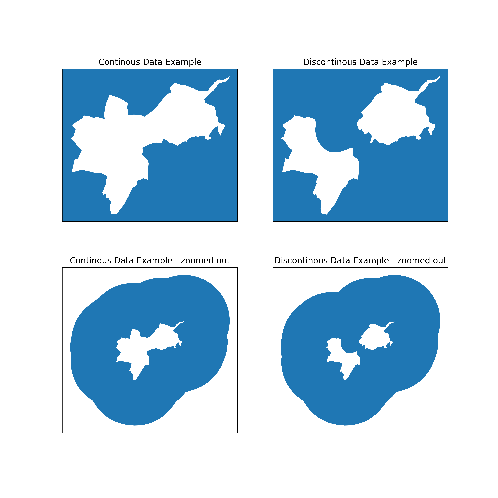

# Geopandas-Mask-Creator
 Automatically create masks for use with non-rectangular spatial data in Geopandas

   
An example use case is shown below.

It works by calculating the minimum width of buffer required to __guarantee__ coverage of the plot. This is then plotted on the same axis as the original data acting as a mask. 
  
A geometric overlay is performed after the buffer is created to ensure any area with data will not be masked. This prevents the danger of two disjointed but nearby areas of data masking one another. 
  
An example of how the buffer is created is shown below. 

